# 使い方

## 起動方法

### Windows 版

起動しようとすると「Windows によって PC が保護されました」というダイアログが表示されるかもしれません。その際は「実行」をクリックしてください。

### Mac 版

初回起動時は、Apple に登録されていないアプリケーションとして警告ダイアログが表示されるかもしれません。

その際は、Finder で `Ctrl` キーを押しながら AivisSpeech アプリケーションアイコンをクリックし、ショートカットメニューから「開く」を選択してから、「開く」をクリックしてください。  
もしくは、「システム設定」→「プライバシーとセキュリティ」 から、ページの下にある「このまま開く」をクリックしてください。

> [!IMPORTANT]  
> **macOS Sequoia 以降をお使いで「Mac に損害を与えたり、プライバシーを侵害する可能性のあるマルウェアが含まれていないことを確認できませんでした」と表示される方は、[こちらの記事](https://qiita.com/suzukidog/items/f0e71297ec5307b473fd) を参考に、アプリケーションの実行を許可してください。**

## 音声合成エンジンの起動

最初に音声合成エンジンが起動します。  
外付け GPU 搭載の PC をお持ちの方は、音声の生成がずっと速い GPU モードを快適にご利用いただけます。

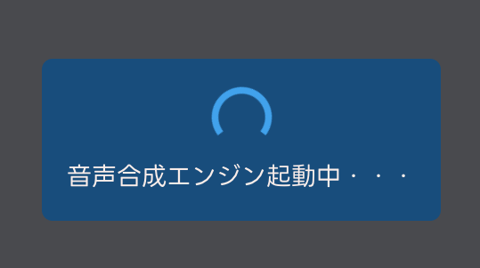

## 音声の生成・再生

話者アイコンの右にある空白をクリックして、テキストを入力してみてください。

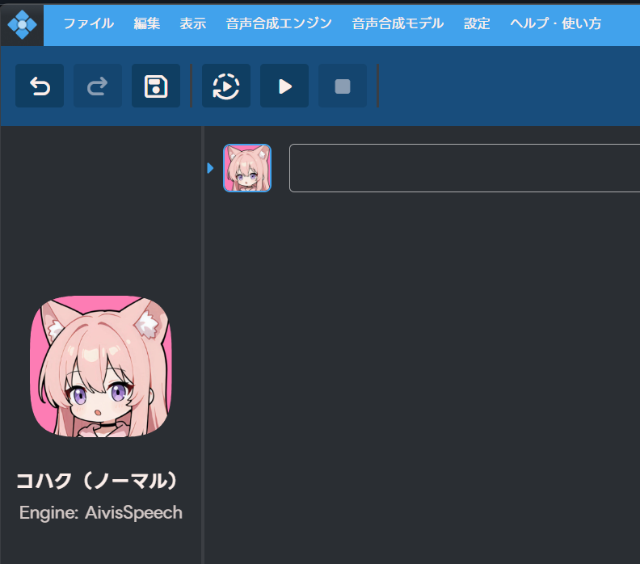

`Enter` キーを押して文章を確定すると、画面の下の方に読みとアクセントが表示されます。  

> [!NOTE]  
> 起動後の初回実行時は、読みとアクセントの反映まで数秒ほど時間がかかることがあります。

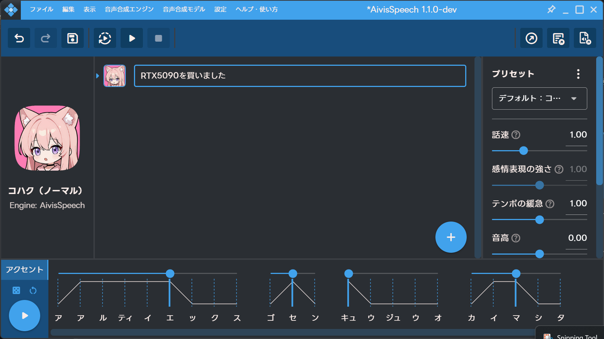

再生ボタンを押すと音声が生成され、音声が再生されます。

## 文章の追加・削除

右下の＋ボタンを押すとテキスト欄が増え、複数の文章を並べることができます。

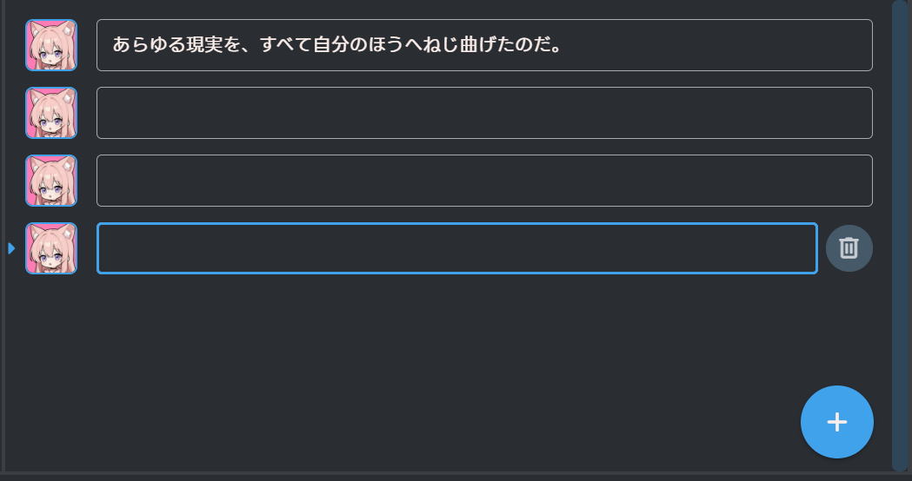

テキスト欄にマウスカーソルを合わせると出てくるゴミ箱のボタンで、そのテキスト欄を削除できます。

## 話者の変更

テキスト入力欄の左にあるアイコンをクリックすると、テキストを読み上げてくれる話者を変更できます。

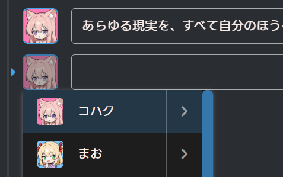

> [!TIP]  
> 話者の表示順序は「設定」→「話者の並び替え設定」から変更できます。

## スタイルの変更

話者によっては複数のスタイル（喋り方）を変えることができます。  
話者の変更と同様に、テキスト欄左のアイコンから選択できます。

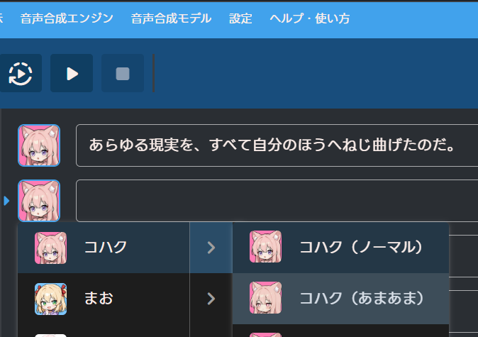

> [!TIP]  
> 話者を選択したときに適用されるスタイルは、「設定」→「デフォルトスタイルの設定」で変更できます。

## テキスト欄の並び替え

テキスト欄周辺をドラッグすることで、テキスト欄の順番を並び替えられます。

## 単語の接続変更

意図しない箇所で単語が分離していた場合や、意図しない形で結合してしまっている場合は、アクセント項目で文字の間をクリックすることで修正できます。

例えば「pyopenjtalk」がこのように分かれてしまった場合は、

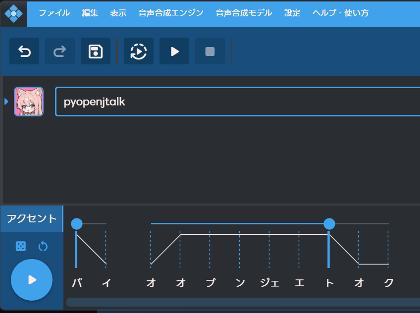

２つの隙間をクリックすると、

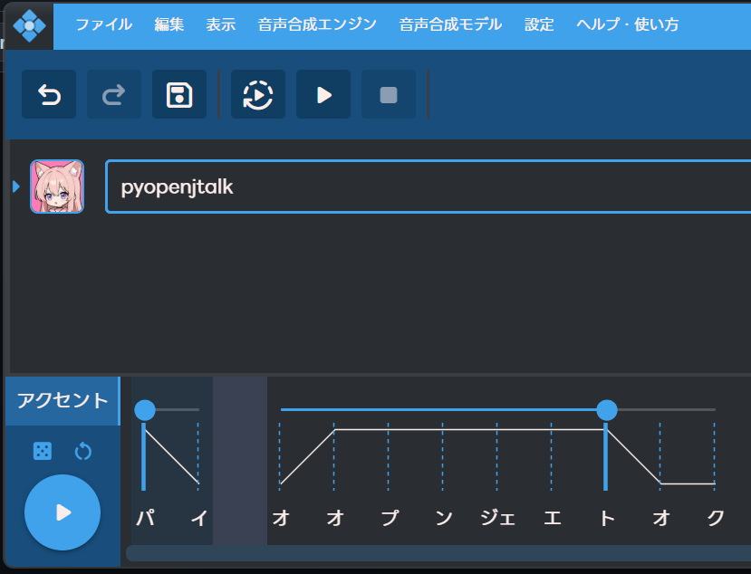

このように、１つのアクセント句にまとめることができます。

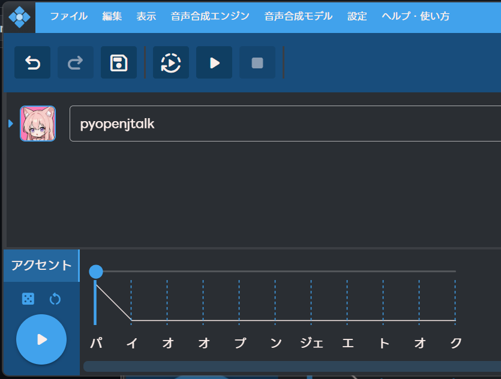

逆に切り離したい場合は、文字の間をクリックして切り離すことができます。

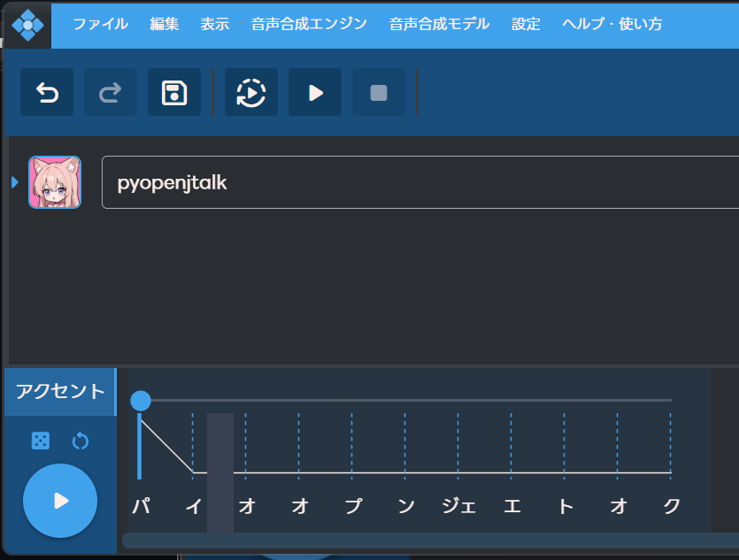

## アクセントの変更

アクセント箇所を変えるには、読みの上にあるバーを左右に動かします。

例えば、「pyopenjtalk」を「パ↗️イオープンジェート↘️ーク」と読んでほしい場合には、「ト」の位置まで、読みの上にある丸いバーをスライドします。

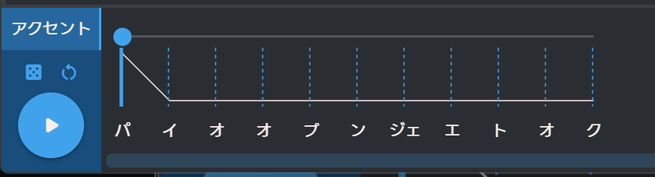<br>
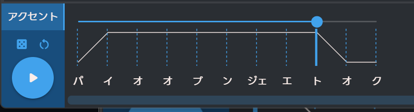

## 読みの修正

日本語の読みは複雑です。  
例えば「明日」を **「アシタ」** ではなく **「アス」** と読ませたい場合や、キラキラネームなどの難しい人名を正しく読ませたい場合などでは、自動生成された読みが意図通りにならないことがあります。  
そんな時は、アクセント欄の読みをクリックして、意図通りの読み方に修正・調整できます。

> [!TIP]  
>  カタカナだけではなく、テキスト欄と同様に、ひらがなや句読点、漢字も入力できます。  
修正箇所以外の読み・アクセントの調整結果はそのままなので、調整結果を維持したままテキストを修正したいときにも便利です。

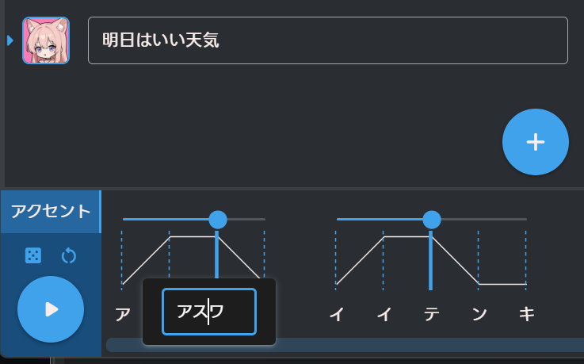

読みを修正すると、読みを修正したアクセント句のアクセント位置が、平板型にリセットされます。  
必要に応じて、再度アクセント位置を調整してください。

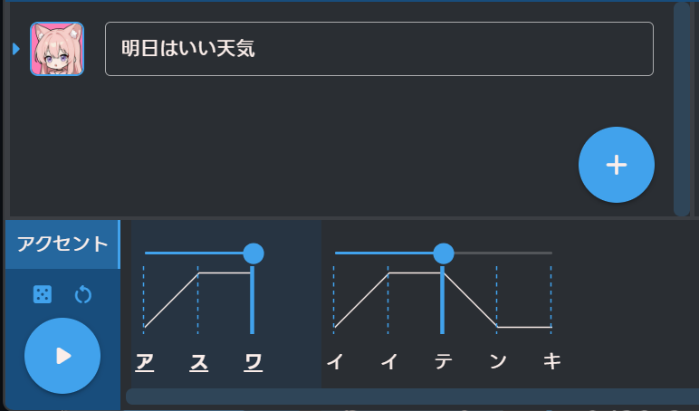<br>
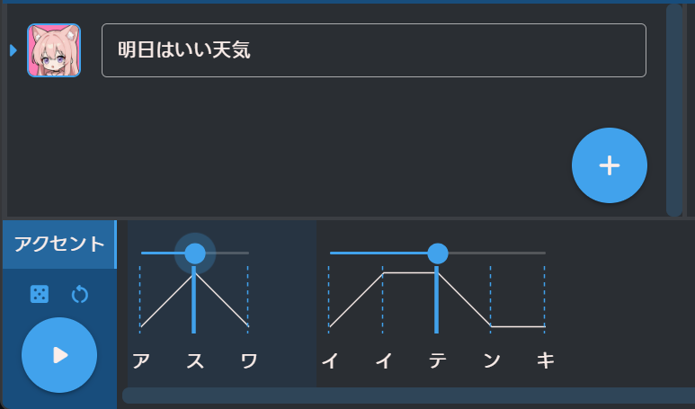<br>

## 音声を途中から再生

アクセント区間（アクセント句）をクリックすることで、そのアクセント句から音声を再生できます。  
アクセント句の背景色が青くなっている状態でもう一度クリックすると、そのアクセント句の選択を解除できます。

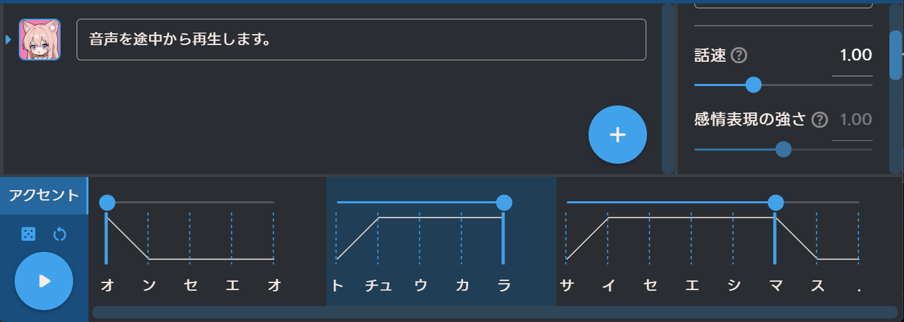

## 音声再生成ボタン（サイコロボタン）

再生ボタンの右にあるサイコロアイコンをクリックすると、音声を再生成した上で再生できます。

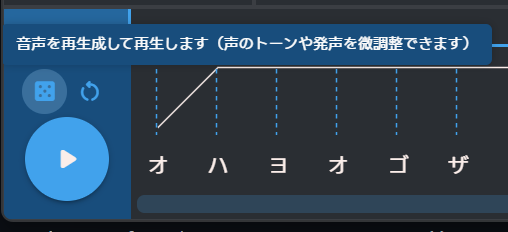

> [!TIP]  
> **AivisSpeech Engine の音声合成結果にはわずかにランダム性があり、同じテキスト・同じパラメータでも、再生成するたびに声のトーンや発声が微妙に変化します。**  
> 声の細かなニュアンスを調整したい際は、何度か再生成を試してみてください。

## 読み・アクセント調整結果リセットボタン

サイコロボタンの右にあるリセットアイコンをクリックすると、手動で修正した単語の読みとアクセントを、すべてデフォルトの状態に戻すことができます。  
読み・アクセントの調整を最初からやり直したいときに便利です。

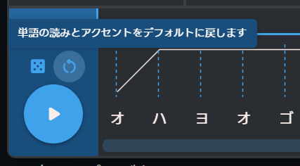

## パラメータの変更

画面の右の欄で、テキスト欄ごとに話速や感情表現の強さなどのパラメータを変更できます。

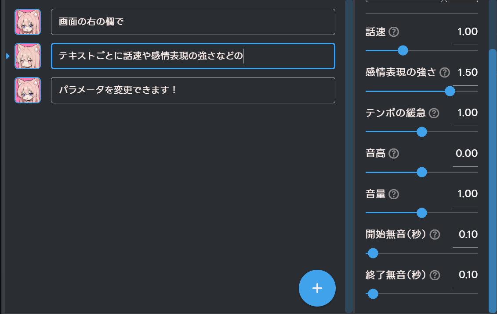

- **話速**
  - 話す速さを調整できます。数値が大きいほど速くなります。
  - 2.00 で 2 倍速、0.50 で 0.5 倍速になります。
- **感情表現の強さ**
  - 選択した話者スタイルの感情表現の強弱を調整できます。
  - 数値が大きいほど、選択した話者スタイルに近い感情表現が込められた声になります。
    - 例えば話者スタイルが「上機嫌」なら、数値が大きいほどより嬉しそうな明るい話し方になります。
    - 一方で、話者やスタイルによっては、数値を上げすぎると発声がおかしくなったり、棒読みで不自然な声になる場合もあります。
    - 正しく発声できる上限値は話者やスタイルごとに異なります。必要に応じて最適な値を見つけて調整してみてください。
  - 全スタイルの平均であるノーマルスタイルでは自動で適切な感情表現が選択されるため、「感情表現の強さ」は無効化されます。
  - AivisSpeech Engine 以外の音声合成エンジン (VOICEVOX ENGINE など) 利用時は「抑揚」の調整パラメータになります。
- **テンポの緩急**
  - 話す速さの緩急の強弱を調整できます。数値が大きいほどより早口で生っぽい抑揚がついた声になります。
  - AivisSpeech Engine 以外の音声合成エンジン (VOICEVOX ENGINE など) には設定できません。
- **音高**
  - 声の高さを調整できます（変更すると音質が劣化します）。数値が大きいほど声のトーンが高くなります。
  - 音声合成処理後に後付けで音高を変更しているため、0.00 から変更すると音質が劣化します。
    - AivisSpeech Engine 以外の音声合成エンジン (VOICEVOX ENGINE など) ではこの限りではありません（各音声合成エンジンの実装依存）。
- **音量**
  - 声の大きさ（音量）を調整できます。数値が大きいほど声が大きくなります。
- **間の長さ**
  - 句読点などの間（ま）の長さを調整できます。数値が大きいほど句読点での間が長くなります。
  - AivisSpeech Engine 以外の音声合成エンジン (VOICEVOX ENGINE など) 利用時のみ設定できます。
- **開始無音・終了無音**
  - 音声先頭・末尾の無音時間の長さを秒単位で調整できます。数値が大きいほど無音時間が長くなります。

## プリセット

プリセット機能を使うと、話速・感情表現の強さ・テンポの緩急などのパラメータをまとめて保存し、ワンクリックで呼び出すことができます。  
プリセット機能は、「設定」→「オプション」→「プリセット機能」をオンにすると利用できます。

> [!NOTE]  
> スタイルごとに1つ、デフォルトプリセットが用意されています。  
> 「設定」→「オプション」→「スタイル変更時にデフォルトプリセットを適用」をオンにすると、スタイルを変更したときに、デフォルトプリセットの内容が自動的に適用されます。

### プリセットの適用

プリセット機能がオンのとき、パラメータ欄の上部に、プリセットドロップダウンが表示されます。  
ドロップダウンからプリセットを選択すると、プリセットに登録されているパラメータの値が一括で適用されます。

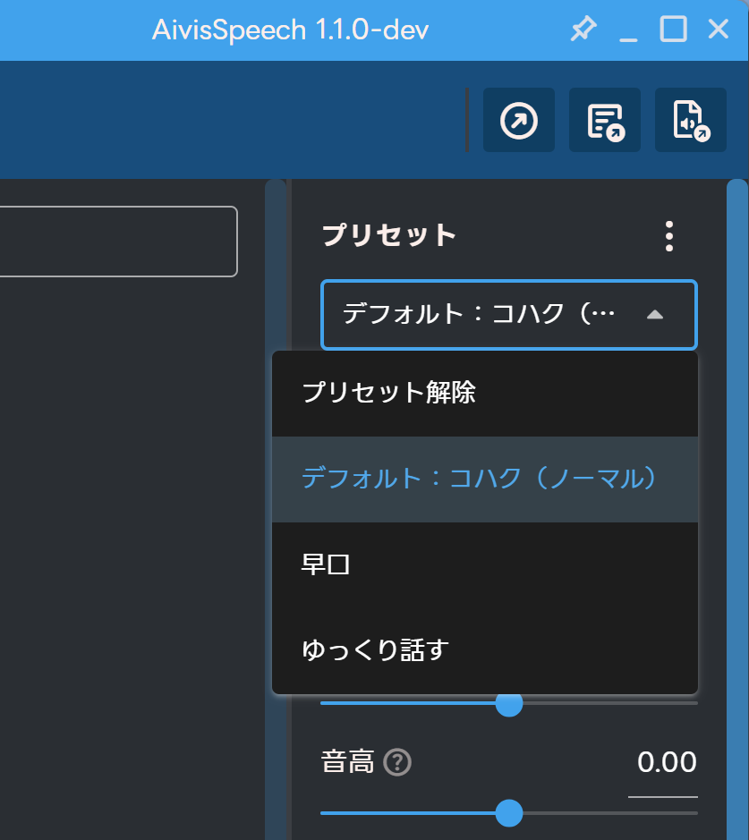

> [!NOTE]
> たとえば、話速を 1.25 に調整したプリセット「早口」を登録し、そのプリセットを別のテキスト欄に適用すると、そのテキスト欄の話速が 1.25 に変更されます。

### プリセットの登録

パラメータを好みに調整した状態で、プリセット名の右にある「登録」ボタンをクリックすると、現在のパラメータを、新しいプリセットとして登録できます。  
表示されたダイアログでプリセット名を入力し、「確定」をクリックしてください。

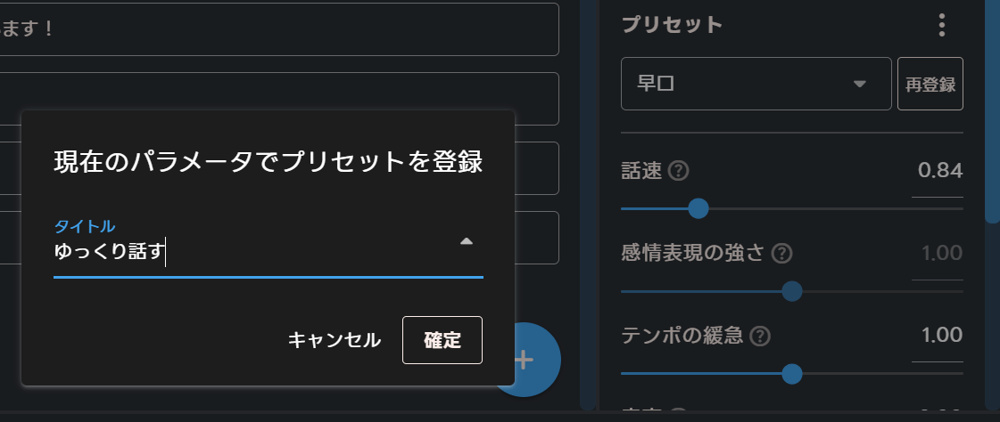

すでに登録済みのプリセットのパラメータを変更した場合は、「再登録」ボタンが表示されます。  
「再登録」ボタンをクリックすると確認ダイアログが表示され、

1. プリセットを更新した上でこのプリセットが設定されたすべてのテキスト欄に再適用する
2. プリセットの更新のみ行う

のいずれかを選択できます。

### プリセットの編集

「設定」→「プリセットを編集」から、プリセットの編集画面を開けます。  
また、プリセット名の右上にある「︙」ボタンからも「プリセットを編集」を選択できます。

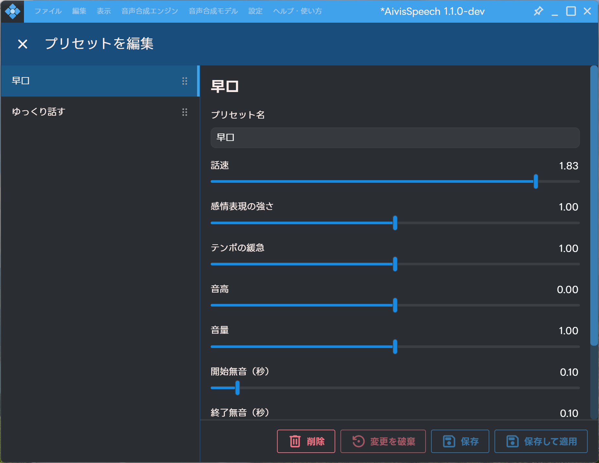

プリセット編集画面では、以下の操作が可能です。

- **プリセット名の変更**: プリセット名を編集できます。
- **パラメータの調整**: 話速・感情表現の強さ・テンポの緩急・音高・音量の各パラメータをスライダーで調整できます。
- **並び替え**: 左ペインのプリセット一覧をドラッグ＆ドロップで並び替えられます。
- **削除**: 不要なプリセットを削除できます。
- **保存**: 変更を保存します。「保存して適用」をクリックすると、変更を保存すると同時に、このプリセットが設定されたすべてのテキスト欄にプリセットが適用されます。

## 音声ファイルの書き出し

「ファイル」→「音声書き出し」を押すと、全テキスト欄の音声が WAV ファイルとして書き出されます。  
特定のテキスト欄だけを書き出したい場合は、「ファイル」→「選択音声を書き出し」を使用してください。  
すべてのテキスト欄の音声を 1 つのファイルにまとめて書き出したい場合は、「ファイル」→「音声をつなげて書き出し」を使用してください。

ファイル名は「設定」→「オプション」→「書き出しファイル名パターン」で変更できます。  
デフォルトでは `$連番$_$キャラ$（$スタイル$）_$テキスト$.wav` の形式で保存されます。

設定でテキストファイル (.txt) や音素ラベルファイル (.lab) も一緒に書き出すこともできます。

## テキストファイルの読み込み

「ファイル」→「テキストを読み込む」から、テキストファイルを読み込めます。

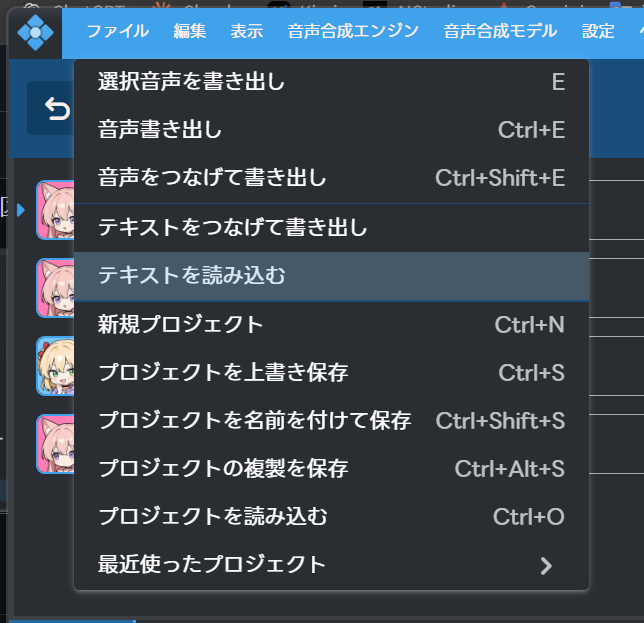

テキストは改行または半角コンマ（,）で区切ることで分割できます。  
また、話者名だけで区切ることで、その話者として読み込むことができます。

例えばこのようなテキストを読み込むと、

```txt
コハク,おはようございます！,こんにちは。
まお,こんばんは！
コハク（せつなめ）,さようなら。
```

このように読み込まれます。

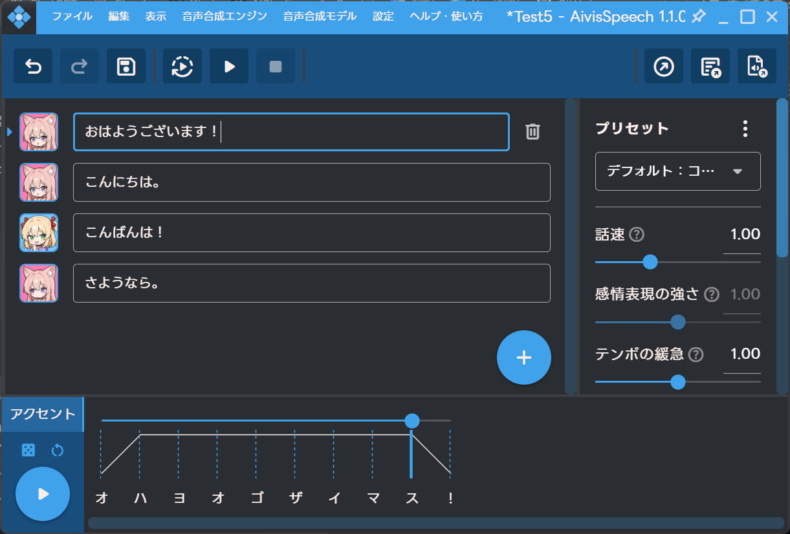

スタイル名が指定されていない場合は、デフォルトスタイルのスタイルが適用されます。

## テキストをつなげて書き出し

「ファイル」→「テキストをつなげて書き出し」ボタンで、エディタ上のすべてのテキストを、テキストファイルに書き出せます。  
テキストには話者名も一緒に保存されます。

「ファイル」→「テキストを読み込む」より、保存したテキストファイルを再度読み込むことができます。

## プロジェクトファイルの保存・読み込み

入力したテキストや話者、アクセント修正やイントネーションの調整結果は、プロジェクトファイルとして保存できます。

プロジェクトファイルを保存しておけば、ソフトウェアを一旦終了し、再度起動し直した後でも状態を復元できます。  
プロジェクトファイルの拡張子は `.aisp` です。

## 音声合成モデルの管理

メニューバーの「音声合成モデル」→「音声合成モデルのインストール・管理」から、インストール済みの音声合成モデルの表示や詳細の確認、音声合成モデルのインストール/更新/アンインストールなどを行えます。

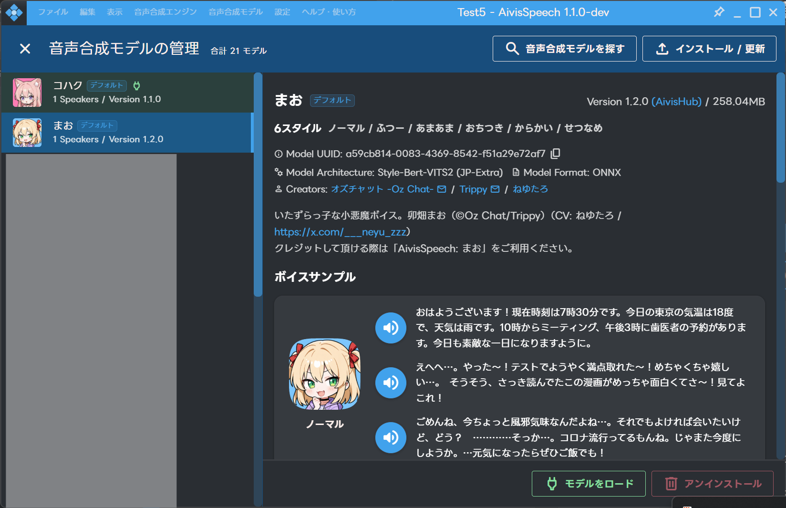

### 管理画面の見方

- **左ペイン**: インストール済みの音声合成モデル一覧が表示されます。  
  各モデルには、話者のアイコン・モデル名・話者数・バージョンが表示されます。
  - <span style="color: #86df9f">緑色の電源アイコン</span> が表示されているモデルは、このモデルが現在メモリにロードされていることを示します。
  - 「デフォルト」バッジは、AivisSpeech に最初から同梱されているモデルであることを示します。
- **右ペイン**: 左ペインで選択した音声合成モデルの詳細情報が表示されます。
  - モデル名・バージョン・ファイルサイズ・スタイル一覧・モデル UUID・モデルアーキテクチャ・モデルフォーマット・制作者情報・説明文を確認できます。
  - AivisHub で公開されているモデルの場合は、バージョンの横に「(AivisHub)」のリンクが表示され、クリックすると AivisHub のモデル詳細ページが開きます。

### ボイスサンプルの試聴

「ボイスサンプル」セクションでは、各スタイルのサンプル音声を試聴できます。  
スピーカーアイコンのボタンをクリックすると再生が始まり、もう一度クリックすると停止します。

### 音声合成モデルのロード・アンロード

画面下部の「モデルをロード」ボタンをクリックすると、選択した音声合成モデルをメモリ上にロードできます。  
ロード済みの音声合成モデルは、「モデルをアンロード」ボタンで、メモリ上から解放できます。

>[!TIP]  
> 通常、音声合成モデルのロードは自動的に行われます。  
> **PC のメモリ残量が逼迫してきた時には、使用頻度の低い音声合成モデルをアンロードすることで、メモリ使用量を節約できます。**

### 音声合成モデルのアップデート

AivisHub で公開されているモデルに新しいバージョンがある場合、左ペインのモデル一覧に「Update!」バッジが表示されます。  
モデル一覧からアップデート可能なモデルを選び、画面下部に表示される「アップデート」ボタンをクリックすると、モデルが最新バージョンに更新されます。

> [!IMPORTANT]  
> アップデートの実行後、音声合成モデルを以前のバージョンに戻すことはできません。

### モデルのアンインストール

画面下部の「アンインストール」ボタンをクリックすると、選択したモデルをアンインストールできます。  
再度インストールするまで、そのモデルは使用できなくなります。

> [!NOTE]  
> AivisSpeech に同梱されているデフォルトの音声合成モデルはアンインストールできません。

## 音声合成モデルのインストール

音声合成モデルを追加でインストールする方法は、大きく分けて 2 つあります。

### AivisHub からインストールする

もっとも簡単な方法は、[AivisHub](https://hub.aivis-project.com/) から直接インストールする方法です。

> [!IMPORTANT]
> **AivisHub から音声合成モデルをインストールする際は、Chrome などの Chromium 系ブラウザをご利用ください。** Firefox でも動作を確認しています。  
> macOS の Safari は、セキュリティ上の制限により、Web サイトからお使いの PC 上で動作しているアプリへのアクセスを禁止しています。**そのため、Safari では AivisHub から直接音声合成モデルをインストールすることができません。**

> [!WARNING]  
> **最近の Chrome では、Web サイトから PC 上で動作しているアプリやサービスへのアクセスに許可が必要になりました。**  
> AivisHub を開いた際に下記のような許可ダイアログが表示された場合は、必ず「**許可する**」をクリックしてください。  
> 
> 「ブロック」をクリックしてしまった場合、AivisHub から起動中の AivisSpeech Engine にアクセスできなくなります。  
> その際は、アドレスバー左のサイト情報アイコン（🔒 など）をクリックし、「サイトの設定」→「ローカルネットワークアクセス」の設定を「許可する」に変更してください。
>
> 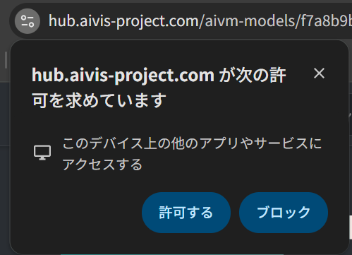

1. メニューバーの「音声合成モデル」→「AivisHub で音声合成モデルを探す」をクリックすると、ブラウザで AivisHub が開きます。
2. AivisHub でお好みの音声合成モデルを見つけたら、モデル詳細ページを開きます。
3. 「AIVMX (AivisSpeech 向け)」タブを選択し、「起動中の AivisSpeech にインストール」ボタンをクリックします。
    - 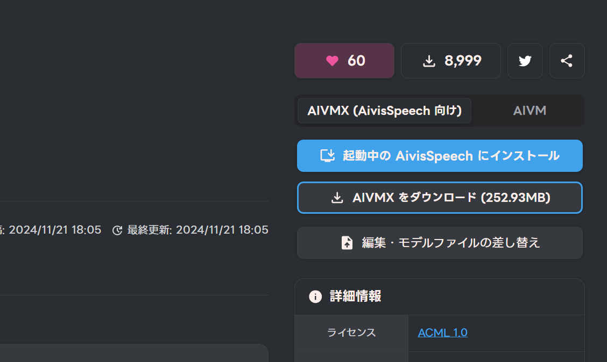
4. AivisSpeech が起動中であれば、自動的にモデルのダウンロードとインストールが行われます。
    - 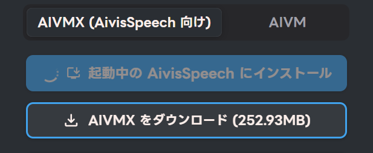
    - 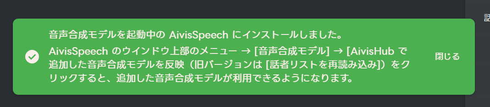
5. インストールが完了したら、メニューバーの「音声合成モデル」→「AivisHub で追加した音声合成モデルを反映」をクリックすると、追加した音声合成モデルが AivisSpeech に反映され、すぐに利用できるようになります。
    - 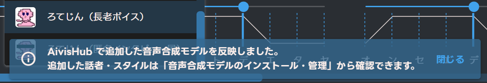

> [!NOTE]  
> すでにインストール済みのモデルは、AivisHub のモデル詳細ページで「インストール済み (v○.○.○)」と表示されます。
>
> 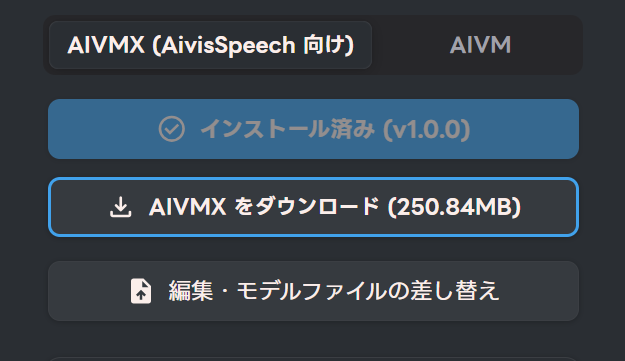

### ファイルや URL からインストールする

AivisHub からダウンロードした AIVMX ファイル (.aivmx) や、手元にある AIVMX ファイルからもインストールできます。

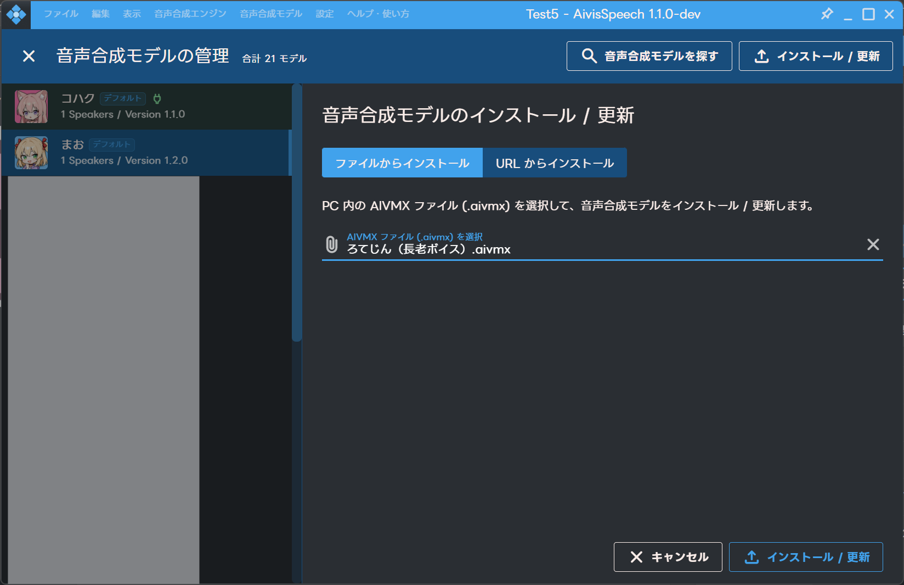

1. 「音声合成モデルの管理」画面の右上にある「インストール / 更新」ボタンをクリックします。
2. インストール / 更新画面が表示されます。
3. 「ファイルからインストール」タブでは、PC 内の AIVMX ファイル (.aivmx) を選択してインストールできます。  
   「URL からインストール」タブでは、AIVMX ファイルのダウンロード URL や AivisHub のモデル詳細ページの URL を指定してインストールできます。
4. ファイルまたは URL を指定したら、右下の「インストール / 更新」ボタンをクリックします。
5. インストールが完了すると、「インストールが完了しました」というダイアログが表示されます。

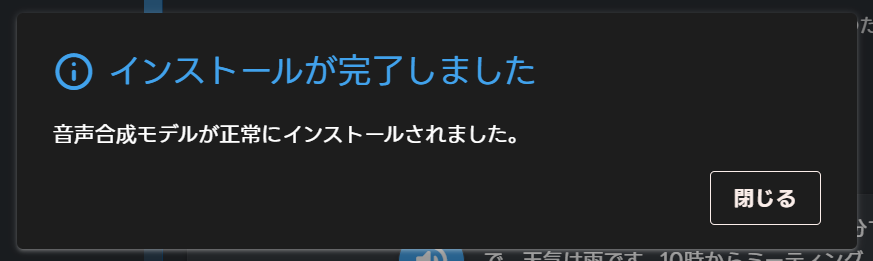

## 話者の並び替え

「設定」→「話者の並び替え設定」から、AivisSpeech で利用できるすべての話者のリストを確認できます。  
また、話者の表示順序を変更したり、サンプルボイスを試聴することもできます。

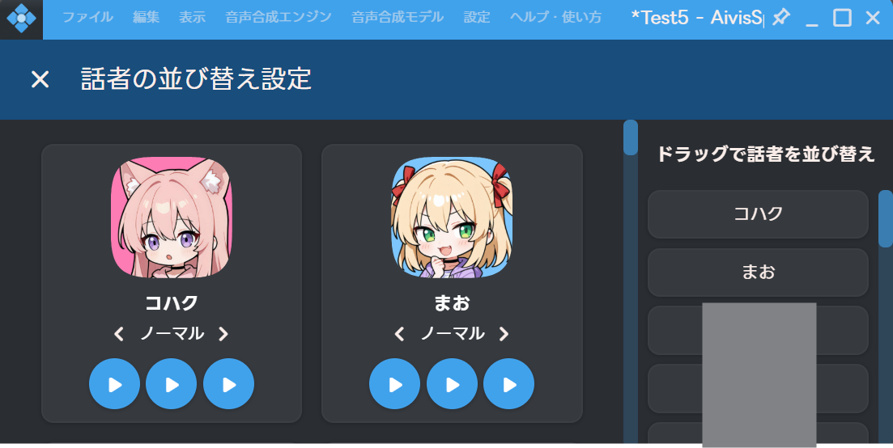

## デフォルトスタイル

「設定」の「デフォルトスタイルの設定」で、話者ごとのデフォルトのスタイルを変更できます。

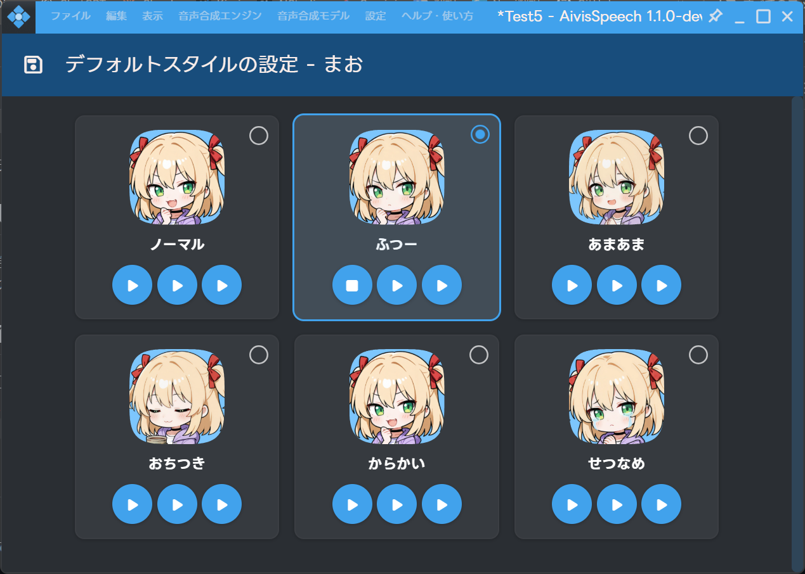

## 読み方＆アクセント辞書

難しい単語や新しい単語は正しい読みにならないことがありますが、ユーザー辞書機能を使い、事前に読み方を登録しておくことができます。  
辞書登録により、毎回読みを修正することなく、意図した読み方で読み上げることができます。  
このユーザー辞書機能は、「設定」→「読み方＆アクセント辞書」から利用できます。

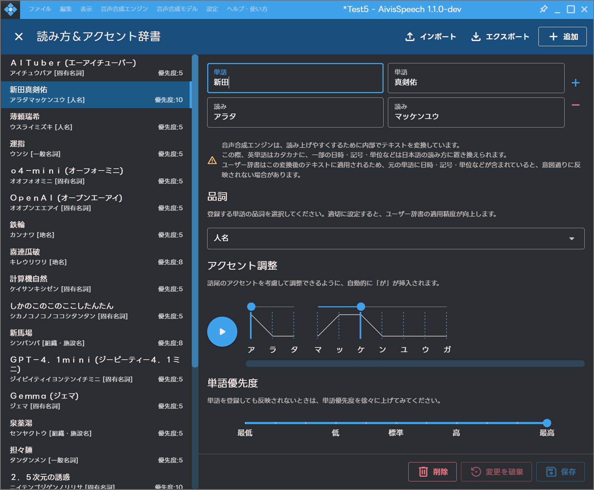

読み方＆アクセント辞書画面を開くと、左側に、登録済みの単語のリストが表示されます。  
右上の「追加」ボタンから、新規に単語を追加できます。

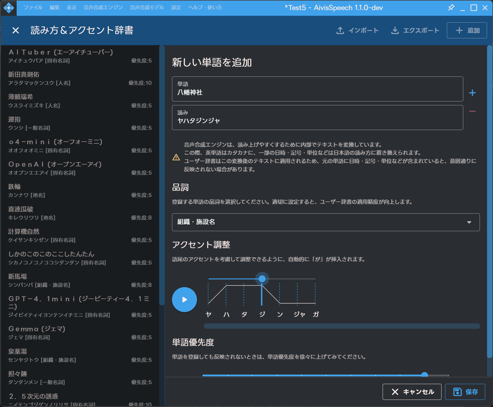

- 「単語」に登録したいテキストを、「読み」にそのテキストの読み方をひらがなかカタカナで入力してください。
  - 単語フォームの右側にある ＋ ボタンを押すと、苗字と名前など、複合語のアクセントを指定できるようになります。
  - 例えば、「新田真剣佑」という単語を登録する場合は、画像のように「新田」と「真剣佑」を分けて登録し、それぞれ「アクセント調整」のスライダーを動かすことで、苗字と名前の両方で自然なアクセント位置を指定できます。
- 「品詞」には、登録する単語の品詞（名詞 / 固有名詞 / 人名 / 地名 など）を選択してください。適切に設定すると、ユーザー辞書の適用精度が向上します。
- 「アクセント調整」のスライダーを左右に動かすことで、自然なアクセント位置を調整できます。
- もし登録した読み方が読み上げ結果に反映されない場合は、「単語優先度」を上げてみてください。

> [!NOTE]  
> 画面右上の「エクスポート」を押すと、この AivisSpeech に登録されているすべてのユーザー辞書データを、JSON ファイル (`user_dict.json`) としてエクスポートできます。  
> 画面右上の「インポート」を押すと、エクスポートした JSON ファイル (`user_dict.json`) を選択して読み込み、ユーザー辞書に追加登録できます。
>
> なお、ユーザー辞書のインポートは、両方のユーザー辞書の内容を足し合わせて登録します。  
> 登録済みの単語が削除されることはありませんので、ご安心ください。
>
> このユーザー辞書のエクスポート／インポート機能は、以下のようなユースケースで便利です。
>
> - AivisSpeech でコツコツ調整してきたユーザー辞書を別の PC にも反映したい
> - ほかの方が作成・配布しているユーザー辞書をインポートしたい
> - [Aivis Cloud API のユーザー辞書](https://hub.aivis-project.com/cloud-api/user-dictionaries) に、AivisSpeech で作成したユーザー辞書を反映したい

## ツールバーのカスタマイズ

ツールバーのボタンをドラッグすると、画面上部にあるツールバーのボタンの配置を変更できます。  
また、ツールバー上の各ボタンの表示・非表示を変更できます。

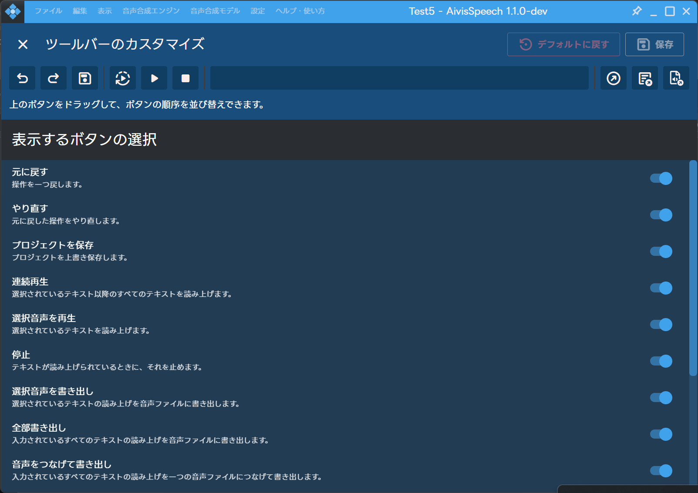

## ショートカットキー

「設定」→「ショートカットキーの変更」でショートカットキーを表示・変更できます。  
（Mac 版をご利用の場合は Ctrl を Command に、Alt を Option に読み替えてください。）

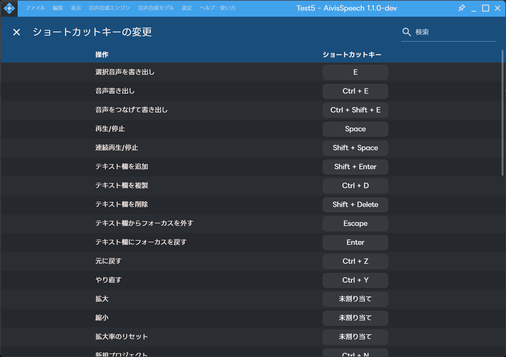

- 上下キー
  - 上下のテキスト欄に移動
- `Space`
  - 音声を再生/停止
- `Shift` + `Space`
  - 連続再生/停止
- `Enter`
  - テキスト欄にフォーカスを戻す
- `Shift` + `Enter`
  - テキスト欄を追加
- `Ctrl` + `D`
  - テキスト欄を複製
- `Shift` + `Delete`
  - テキスト欄を削除
- `Ctrl` + `N`
  - 新規プロジェクト
- `Ctrl` + `O`
  - プロジェクトを読み込む
- `Ctrl` + `S`
  - プロジェクトを上書き保存
- `Ctrl` + `Shift` + `S`
  - プロジェクトを名前を付けて保存
- `Ctrl` + `Alt` + `S`
  - プロジェクトの複製を保存
- `E`
  - 選択音声を書き出し
- `Ctrl` + `E`
  - 音声書き出し（全テキスト欄）
- `Ctrl` + `Shift` + `E`
  - 音声をつなげて書き出し
- `Ctrl` + `Z`
  - 元に戻す
- `Ctrl` + `Y`
  - やり直す
- `Esc`
  - テキスト欄からフォーカスを外す
- `F11`（Mac: `Ctrl` + `Command` + `F`）
  - 全画面表示を切り替え
- スライダーの上でマウスホイール
  - スライダーの値を変更します（スライダー →）
  - `Ctrl` キーを押しながらマウスホイールを使うと更に細かく調整できます
- `Ctrl` + 数字
  - 数字番目の話者を選択（`Ctrl` + `0` で 10 番目）

## オプション

「設定」→「オプション」から、AivisSpeech の各種設定を変更できます。

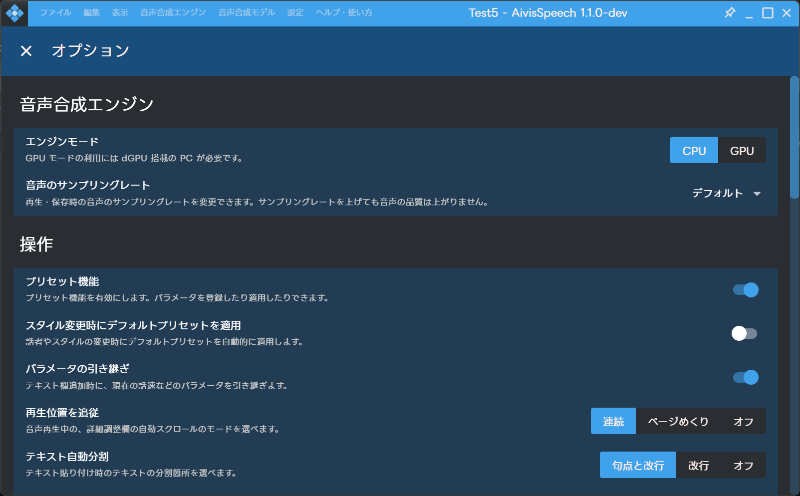

### 「音声合成エンジン」項目

音声合成エンジンの動作に関する設定を変更できます。

#### エンジンモード

- **Windows**: GPU モードの利用には外付け GPU (dGPU) 搭載の PC が必要です。
  - 推論処理には [DirectML](https://github.com/microsoft/DirectML) を利用しています。
  - **CPU 内蔵の GPU (iGPU) のみの PC でも GPU モードは使えますが、ほとんどの場合 CPU モードよりかなり遅くなってしまうため、おすすめできません。**
- **Mac**: GPU モードはサポートされていませんが、CPU モードでも十分高速に動作します。

#### 音声のサンプリングレート

音声のサンプリングレートを変更して再生・保存します。  
サンプリングレートを高くしても音声の品質は上がりません。

### 「操作」項目

#### プリセット機能

話速やテンポの緩急などのパラメータをまとめて登録できるプリセット機能を利用できるようになります。ソフトウェアが終了しても設定したプリセットは残ります。  
詳しい使い方は「プリセット」セクションをご覧ください。

#### スタイル変更時にデフォルトプリセットを適用

プリセット機能をオンにしている場合、スタイルを変更したときにデフォルトプリセットを自動的に適用するようになります。

#### パラメータの引き継ぎ

テキスト欄を追加する際、話速やテンポの緩急といったパラメータを引き継ぐようになります。

#### 再生位置を追従

再生中の単語が画面内に収まるよう、自動的にスクロールして追従するようになります。  
「連続」「ページめくり」「オフ」の 3 つの追従モードから選択できます。

#### テキスト自動分割

テキストを貼り付ける時、句点や改行でテキストを分割するかの挙動を変更できます。  
「句点と改行」「改行」「オフ」から選択できます。

#### メモ機能

テキストを `[]` で囲むことで、テキスト中にメモを書けます。半角の `[]` と全角の `［］` のどちらにも対応しています。

#### ルビ機能

テキストに `{ルビ対象|よみかた}` と書くことでテキストの読み方を変えられるようになります。  
半角の `{|}` と全角の `｛｜｝` のどちらにも対応しています。書き出しテキストを変えずに読み方を変えたいときに便利です。

#### 非表示にしたヒントを再表示

操作中に表示されるヒントメッセージで「今後表示しない」を選択して非表示にしたものを、すべて再表示するようにリセットできます。

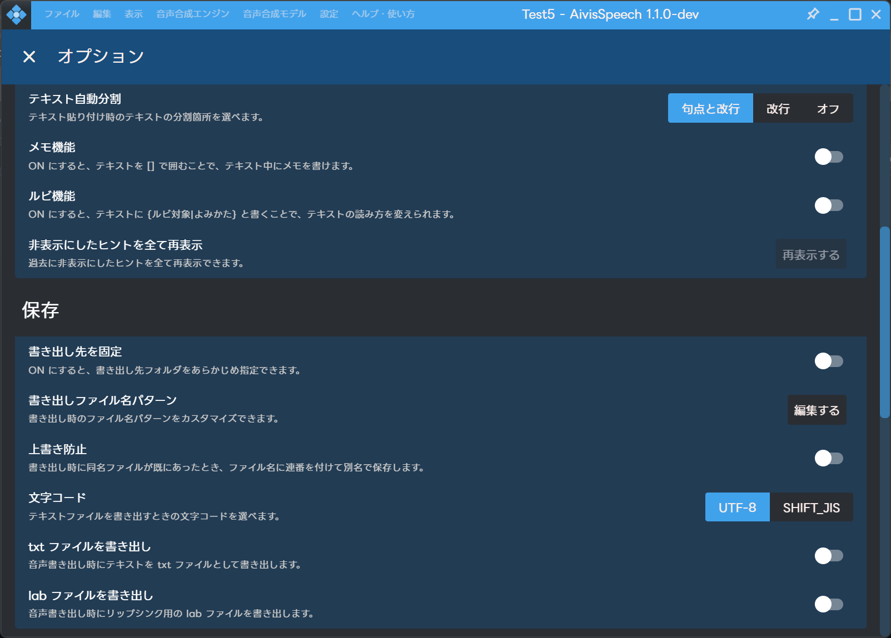

### 「保存」項目

#### 書き出し先を固定

音声ファイルを書き出すフォルダを固定し、毎回フォルダを選択しなくても同じフォルダに書き出し続けるようにします。

#### 書き出しファイル名パターン

音声やテキストファイルなどを書き出す際のファイル名をカスタマイズできます。  
`$連番$`・`$キャラ$`・`$スタイル$`・`$テキスト$`・`$日付$`・`$プロジェクト名$` などのタグを組み合わせて、自由にパターンを設定できます。

#### 上書き防止

同じファイル名のファイルがあった場合に連番として保存します。

#### 文字コード

読み込み・書き込み用の文字コードを選択できます。

#### txt ファイルを書き出し

テキスト内容を一緒に保存します。

#### lab ファイルを書き出し

リップシンクなどに便利な、音声の音素情報とそのタイミング情報が書かれたラベルファイルを一緒に保存します。

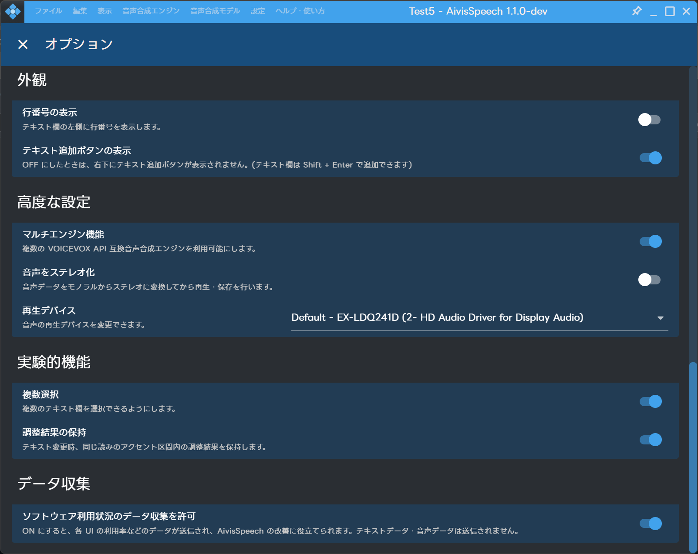

### 「外観」項目

#### 行番号の表示

テキスト欄の左に行番号を表示します。

#### テキスト追加ボタンの表示

テキスト追加ボタンを非表示にできます。ショートカットキー `Shift` + `Enter` でテキスト欄を追加できます。

### 「高度な設定」項目

#### マルチエンジン機能

VOICEVOX API 準拠音声合成エンジンを AivisSpeech 内で利用できるようになります。  
マルチエンジン機能をオンにしたあと、メニューにある「音声合成エンジン」の「音声合成エンジンの管理」に移動し、次のどちらかを実行すると利用できます。

- VOICEVOX API 準拠音声合成エンジンの VVPP ファイルをインストールする
- VOICEVOX 系ソフトウェア内の音声合成エンジンのパスを指定する

#### 音声をステレオ化

音声をモノラルからステレオに変換して再生・保存します。

#### 再生デバイス

音声を再生するデバイスを変更できます。  
デフォルトでは OS の既定の再生デバイスが使用されます。

### 「実験的機能」項目

開発中の便利機能を利用できます。

#### 複数選択

複数のテキスト欄を選択できるようになります。  
`Shift` キーを押しながらクリックすることで、最後に選択したテキスト欄からクリックしたテキスト欄までのすべてのテキスト欄を選択できます。  
`Ctrl` キーを押しながらクリックすることで、複数のテキスト欄を個別に選択できます。

#### 調整結果の保持

テキストを変更した際、同じ読みのアクセント区間内での読み・アクセントの調整結果を保持します。

### 「データ収集」項目

#### ソフトウェア利用状況のデータ収集を許可する

各 UI の利用率などのデータを送信し、AivisSpeech の改善に役立てます。  
なお、入力されたテキストデータや音声データの情報は収集しておりませんので、ご安心ください。

## その他

右上のピンボタンをクリックすると、ウィンドウを最前面に固定できます。

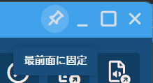

## ヘルプ・使い方

メニューバーの「ヘルプ・使い方」をクリックすると、このヘルプドキュメントやライセンス情報などを確認できます。

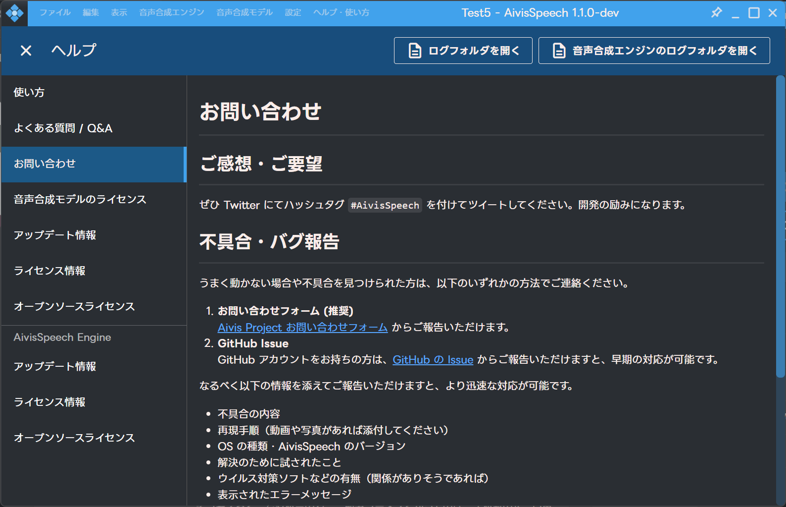

## アンインストール方法

### Windows 版

インストールしたフォルダの中にある Uninstall AivisSpeech.exe を実行してください。

すべての設定データを削除するには、以下のフォルダを削除してください。

- `C:\Users\(ユーザー名)\AppData\Roaming\AivisSpeech`
- `C:\Users\(ユーザー名)\AppData\Roaming\AivisSpeech-Engine`

### Mac 版

「アプリケーション」フォルダにある AivisSpeech を「ゴミ箱」にドラッグ＆ドロップしてください。

マルチエンジン機能で追加した音声合成エンジンを削除する場合は、Finder のメニューバーの「移動」をクリックし、「フォルダへ移動」をクリックして表示された画面に `~/Library/Application Support/AivisSpeech` と入力して `Enter` キーを押し、`vvpp-engines` フォルダを削除すれば完了です。

すべての設定データを削除するには、以下のフォルダを削除してください。

- `~/Library/Application Support/AivisSpeech`
- `~/Library/Application Support/AivisSpeech-Engine`
- `~/Library/Logs/AivisSpeech`

## ご感想・ご要望・バグ報告など

ご感想・ご要望は、ぜひ Twitter (X) にてハッシュタグ `#AivisSpeech` を付けてツイートしてください。開発の励みになります。

うまく動かない場合や不具合を見つけられた方は、ぜひ [Aivis Project お問い合わせフォーム](https://docs.google.com/forms/d/e/1FAIpQLSd1gi8lMW1mpdrkCHbM090pWmWhKgz4tR1Obc9G9hOuWpZPsA/viewform) までご連絡いただけますと幸いです。  
メニューバーの「設定」→「フィードバックを送る」からもお問い合わせフォームにアクセスできます。

その他、 Q&A に掲載されていないご質問があれば Aivis Project 公式 ([@aivis_project](https://twitter.com/aivis_project)) または上記のお問い合わせフォームからご連絡ください。
